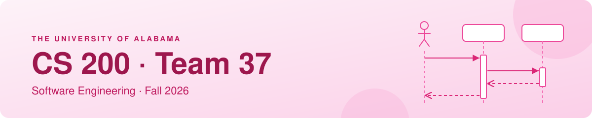
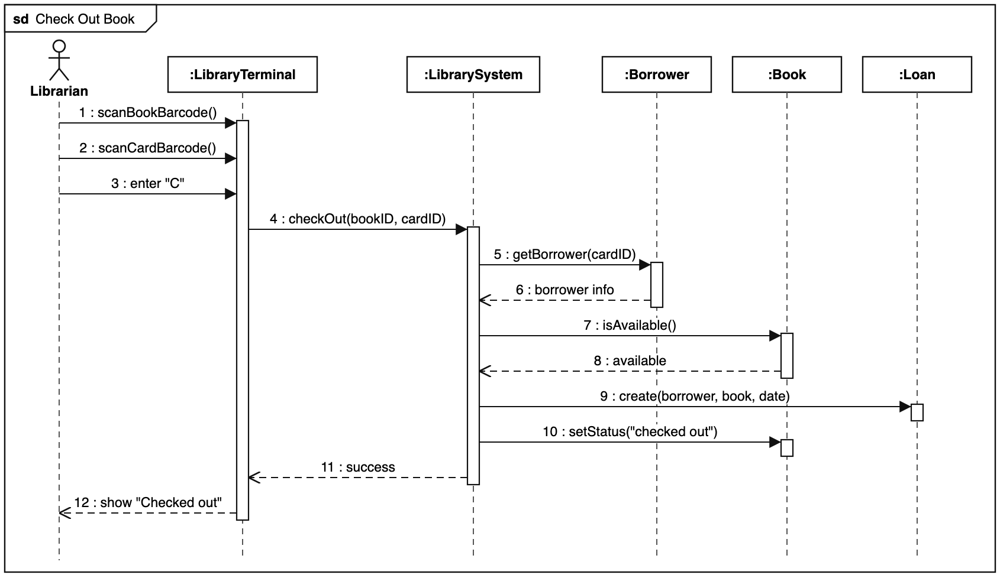

  

  
  
  

Welcome to our team repository for **CS 200 (Software Engineering)** at The University of Alabama.
We use this repo to practice Git and GitHub and to share our team assignments.

## 👥 Team Members

| Faizan Khan | Maggie Skinner | Martin Devanathan | Tallon King | Alyssa Duncan |
| :---: | :---: | :---: | :---: | :---: |

## 📚 Assignments

| Assignment | Description | Link |
| --- | --- | --- |
| Lab 2 – Git Practice | Created this repo and practiced basic Git commands | [commit 40bffbe](https://github.com/Marti977/cs200-lab2-team37/commit/40bffbe) |
| Sequence Diagram | Sequence diagram for the *Check Out Book* use case | [PDF](sequence-diagram/Team37_Sequence_Diagram.pdf) |

## 📐 Sequence Diagram – Check Out Book

The librarian scans the book and the borrower's card, then enters **C** at the terminal.
The system checks the borrower and the book, creates a loan, and marks the book as checked out.

  

📄 Full document: [Team37_Sequence_Diagram.pdf](sequence-diagram/Team37_Sequence_Diagram.pdf)

## 💡 What We Learned

- **Lab 2:** how to use basic Git commands in Git Bash.
- **Sequence Diagram:** how to show the order of messages between objects for one use case.

---

Made with 💗 by Team 37 · Roll Tide!

